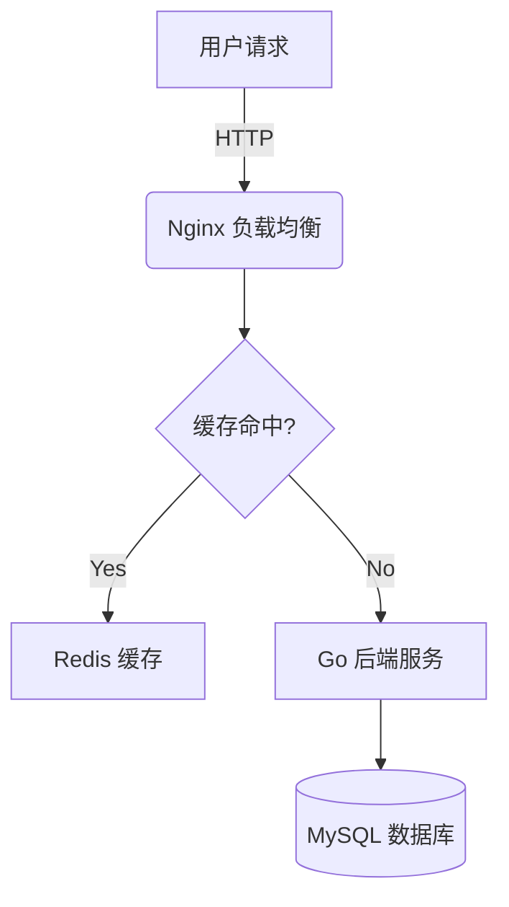

# 功能测试:Add MathJax and Mermaid support

## 1. 数学公式 (LaTeX)

行内公式：算法的时间复杂度是 $O(n \log n)$。

块级公式 (B+树分裂条件)：

$$
\sum_{i=0}^{n} i^2 = \frac{n(n+1)(2n+1)}{6}
$$

## 2. 系统设计图 (Mermaid)

```mermaid
graph TD
    A[用户请求] -->|HTTP| B(Nginx 负载均衡)
    B --> C{缓存命中?}
    C -->|Yes| D[Redis 缓存]
    C -->|No| E[Go 后端服务]
    E --> F[(MySQL 数据库)]
```